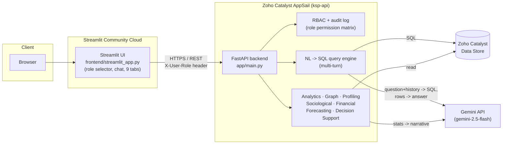

# KAVAL AI

**Karnataka AI Voice & Analytics for Law enforcement** — an intelligent conversational AI and crime analytics platform for the Karnataka State Police (KSP) crime database. Ask a question in English or Kannada and get a sourced answer; beyond that, discover criminal networks, sociological patterns, offender risk, financial trails, and emerging crime trends — all grounded in the same auditable data.

**Live app:** https://kaval-ai-z3f3khdbtekczzydaghtz6.streamlit.app

**API:** https://ksp-api-50044130144.development.catalystappsail.in

---

## Problem Statement

*Track: Intelligent Conversational AI for KSP Crime Database*

Police FIR data is rich but locked behind SQL and static reports. An officer investigating a pattern — "how many cybercrime cases in Mysuru this quarter," "which suspects keep showing up together" — either waits on a report or learns a query language. In a state with two working languages, that gap is worse: most analytics tooling only speaks English.

The official challenge framework asks for more than retrieval: crime pattern discovery, criminal network analysis, socio-demographic insight, criminological profiling, and proactive prevention intelligence — all through a conversational front door, and all explainable. KAVAL AI's approach is to make the conversational layer the *interface* to every one of those capabilities, not a separate feature bolted alongside them: one bilingual chat surface that can answer a direct question, but also hand off to purpose-built analysis (network graphs, risk scoring, forecasting) when the question calls for it — with the evidence trail always visible.

## Key Features

| Area | What it does |
|---|---|
| 🔍 **Conversational Query** | Bilingual (English/ಕನ್ನಡ) NL→SQL over FIRs, suspects, and victims. Multi-turn — follow-up questions ("what about Mysuru instead?") resolve against prior context. Every answer shows its generated SQL. Voice input (speech-to-text) and voice output (text-to-speech) both supported. Full conversation history exportable as a PDF. |
| 🕸️ **Criminal Network Analysis** | Suspect-to-suspect associations (gang/family/co-accused), plus location and (optionally) victim nodes in the same graph. Community detection and centrality ranking surface key figures automatically. |
| 📊 **Crime Pattern & Trend Analytics** | Aggregate stats by crime type, district, area, status, and month, with an AI-written briefing. |
| 🏛️ **Sociological Insights** | Demographic breakdowns of accused persons (gender, socio-economic band, education) and their correlation with crime type and area — framed as observed patterns in this dataset, not causal claims. |
| 🧬 **Offender Profiling** | A transparent, weighted risk score (prior cases + network centrality + recency + crime-type versatility) per suspect, with the full points breakdown shown — plus an AI-written behavioral summary from case history. |
| 🗂️ **Investigator Decision Support** | AI-generated case summaries and suggested investigative leads per FIR, plus a similar-past-cases search by shared crime type/district/area. |
| 💰 **Financial Crime & Transaction Analysis** | A transaction graph over suspects' financial accounts, with transparent heuristic flags (high-value transfers, FIR-linked transactions, multi-counterparty "mule" accounts). Restricted to the Supervisor role. |
| 📈 **Crime Forecasting & Early Warning** | Trend extrapolation per district/crime-type over the last 6 months, flagging accelerating combinations — an honest first-pass heuristic, not a trained ML model. |
| 🛡️ **Explainable by default** | Every AI answer — query, summary, risk score, forecast — shows the data or formula behind it. No black-box numbers. |
| 🔐 **Role-Based Access & Governance** | Four roles (Investigator/Analyst/Supervisor/Policymaker) gate which endpoints and tabs are available; every API access is written to an audit log. |

## Architecture



The frontend and backend are deployed independently and talk over plain HTTPS — there's no shared process or session state between them, which is what lets each half live on the platform best suited to it (see [Deployment](#deployment) for why).

## Tech Stack

| Layer | Technology |
|---|---|
| Frontend | [Streamlit](https://streamlit.io) — Python-native reactive UI, Plotly for charts/network graphs, [fpdf2](https://py-pdf.github.io/fpdf2/) (+ bundled Noto Sans Kannada font) for PDF export, browser-native Web Speech API for voice in/out |
| Backend | [FastAPI](https://fastapi.tiangolo.com) on Uvicorn — async REST API |
| LLM | Google **Gemini** (`gemini-2.5-flash`) for NL→SQL translation and narrative generation, with Anthropic Claude as a drop-in alternate provider |
| Data store | SQLite locally / **Zoho Catalyst Data Store** (via ZCQL) in production |
| Graph analysis | [NetworkX](https://networkx.org) — association graphs, community detection, centrality |
| Auth | Zoho Catalyst session authentication (`zcatalyst-sdk`) + an application-level role permission system (`app/core/rbac.py`) |
| Hosting | **Zoho Catalyst AppSail** (backend) + **Streamlit Community Cloud** (frontend) |
| Language | Python 3.12 |

## Data Model

Nine tables, seeded synthetically for demo purposes (`data/seed.py`) and swappable for real data of the same shape. The seeder and the LLM's query-generation prompt both read from `app/core/schema.py`, so they never drift apart.

| Table | Purpose | Key columns |
|---|---|---|
| `fir_records` | One row per First Information Report | `fir_id`, `date_filed`, `district`, `police_station`, `crime_type`, `area`, `status`, `section_of_law` |
| `suspects` | One row per known suspect/accused | `suspect_id`, `name`, `age`, `gender`, `known_address`, `prior_cases`, `socio_economic_band`, `education_level`, `modus_operandi` |
| `fir_suspect_links` | Many-to-many: accused/witnesses per FIR | `fir_id`, `suspect_id`, `role` (Accused / Witness) |
| `suspect_associations` | Explicit ties between suspects | `suspect_id_a`, `suspect_id_b`, `relation_type`, `confidence` |
| `victims` | One row per crime victim, kept separate from suspects | `victim_id`, `name`, `age`, `gender`, `contact_area` |
| `fir_victim_links` | Many-to-many: victims per FIR | `fir_id`, `victim_id`, `impact` |
| `financial_accounts` | Accounts linked to known suspects | `account_id`, `suspect_id`, `bank_name`, `account_number_masked`, `account_type` |
| `financial_transactions` | Transactions between those accounts | `transaction_id`, `from_account_id`, `to_account_id`, `amount`, `txn_date`, `fir_id`, `flagged_suspicious`, `flag_reason` |
| `audit_log` | Append-only access log for governance | `log_id`, `logged_at`, `role`, `endpoint`, `summary` |

`financial_accounts`, `financial_transactions`, and `audit_log` are deliberately **excluded** from the open-ended NL→SQL prompt — they're sensitive/governance data, served only through dedicated, role-gated, code-controlled endpoints, never through LLM-generated SQL.

## Roles & Permissions

There's no real login yet (see [Security Notes](#security-notes)) — a sidebar selector lets you pick a role, sent as an `X-User-Role` header on every request and enforced server-side by `app/core/rbac.py`. The frontend also hides tabs a role can't use, so what you see matches what you're allowed to do.

| Endpoint group | Investigator | Analyst | Supervisor | Policymaker |
|---|:---:|:---:|:---:|:---:|
| Conversational query | ✅ | ✅ | ✅ | — |
| Analytics dashboard | ✅ | ✅ | ✅ | ✅ |
| Suspect network graph | ✅ | ✅ | ✅ | — |
| Offender profiling | ✅ | ✅ | ✅ | — |
| Sociological insights | ✅ | ✅ | ✅ | ✅ |
| Crime forecasting | ✅ | ✅ | ✅ | ✅ |
| Decision support | ✅ | ✅ | ✅ | — |
| Financial crime analysis | — | — | ✅ | — |
| Audit log | — | — | ✅ | — |

## API Reference

All endpoints are served under `/api` by the FastAPI backend and require an `X-User-Role` header (defaults to `Investigator` if omitted; an unrecognized role gets `400`, a disallowed one gets `403`).

| Method | Path | Purpose |
|---|---|---|
| `POST` | `/api/query` | Natural-language question → SQL generated, executed, and answered in the same language. Accepts optional `history` (prior turns) for follow-up questions. |
| `GET` | `/api/analytics` | Aggregate FIR statistics. `?language=en\|kn` and `?summary=true` add an LLM-written briefing. |
| `GET` | `/api/graph` | Criminal network: suspects + locations (+ victims with `?include_victims=true`), edges, layout, and centrality/community stats. |
| `GET` | `/api/profiling/top` | Priority investigation list — highest-risk suspects ranked. `?limit=` |
| `GET` | `/api/profiling/{suspect_id}` | Full risk profile: score, transparent breakdown, AI behavioral summary, case history. |
| `GET` | `/api/sociological` | Demographic breakdowns and area-level correlations, with an AI briefing. `?language=en\|kn` |
| `GET` | `/api/forecast` | Trend projections and early-warning flags per district/crime-type. |
| `GET` | `/api/case-summary/{fir_id}` | AI case summary, suggested leads, accused/victim lists, similar past cases. |
| `GET` | `/api/financial` | Financial account network, flagged transactions, mule-account detection. **Supervisor only.** |
| `GET` | `/api/audit-log` | Recent access log entries. **Supervisor only.** |
| `GET` | `/api/health` | Liveness probe — returns `{"status": "ok"}`. |
| `POST` | `/api/debug/seed` | Diagnostics: bulk-insert rows. **Disabled** (`DEBUG_ERRORS=false`) outside local dev. |
| `GET` | `/api/debug/zcql` | Diagnostics: run a raw ZCQL query. **Disabled** (`DEBUG_ERRORS=false`) outside local dev. |

### `POST /api/query` — request / response

```jsonc
// Request
{
  "question": "What about Mysuru instead?",
  "history": [
    {"question": "How many thefts in Bengaluru Urban?", "answer": "There were 45 thefts reported in Bengaluru Urban."}
  ]
}

// Response
{
  "question": "What about Mysuru instead?",
  "sql": "SELECT COUNT(fir_id) FROM fir_records WHERE crime_type = 'Theft' AND district = 'Mysuru'",
  "explanation": "Counts theft FIRs filed in Mysuru, carrying over the crime type from the prior turn.",
  "rows": [{ "COUNT(fir_id)": 12 }],
  "answer": "There were 12 thefts reported in Mysuru.",
  "language": "en"
}
```

### Request flow for a question

1. Streamlit posts the question — plus the last few conversation turns, if any — to `/api/query`.
2. The backend sends the question, conversation context, the table schema, and safety rules to Gemini, asking for a single `SELECT` as structured JSON (`app/services/query_engine.py`).
3. The generated SQL is checked against a denylist (`insert`/`update`/`delete`/`drop`/`alter`/`attach`/`pragma`) before it's allowed to run.
4. The query executes against the Catalyst Data Store (or local SQLite).
5. The question, SQL, and resulting rows go back to Gemini, which writes a concise answer in the same language the question was asked in.
6. The full result returns to the UI in one response and is appended to the on-screen conversation thread.

If Gemini is rate-limited or briefly unavailable, every AI narrative call (query answers, dashboard briefings, behavioral summaries, case narratives) degrades gracefully to a clear fallback message rather than a raw error — see [Security Notes](#security-notes) for why the retry budget is deliberately short.

## Project Structure

```
app/
  main.py                  FastAPI app, middleware, error handling
  api/routes.py             All route definitions + RBAC wiring
  core/
    catalyst_auth.py        Session auth (no-op locally, Catalyst-validated in prod)
    catalyst_datastore.py   SQLite / Catalyst Data Store abstraction
    llm_client.py            Gemini / Anthropic provider-agnostic LLM client
    rbac.py                   Role permission matrix + audit logging
    schema.py                  Shared table schema definitions
  services/
    query_engine.py          NL -> SQL -> answer pipeline (multi-turn)
    analytics.py               Aggregate stats + LLM briefing
    graph_builder.py           Criminal network construction (NetworkX)
    profiling.py                Offender risk scoring + behavioral profiling
    sociological.py             Demographic breakdowns + correlations
    financial.py                 Transaction network + mule-account detection
    forecasting.py               Trend extrapolation + early warning
    decision_support.py          Case summaries, leads, similar cases
frontend/
  streamlit_app.py           Streamlit UI (role selector + 9 tabs)
  fonts/NotoSansKannada.ttf    Bundled font so PDF export renders Kannada
data/
  seed.py                     Synthetic data generator (all 9 tables)
  export_csv.py                 Dump SQLite tables to CSV
  export/                       CSV snapshots of seeded data
deploy/
  backend/, frontend/           Vendored, deployment-ready copies used by
                                  Catalyst AppSail (not committed — see below)
```

## Getting Started (local development)

```bash
# 1. Clone and set up a virtual environment
git clone https://github.com/divya-d510/kaval-ai.git
cd kaval-ai
python -m venv .venv
.venv\Scripts\activate        # Windows
# source .venv/bin/activate   # macOS/Linux

# 2. Install dependencies
pip install -r requirements.txt

# 3. Configure environment
cp .env.example .env
# then edit .env and set GEMINI_API_KEY (free tier: https://aistudio.google.com/apikey)

# 4. Seed the local database (all 9 tables)
python -m data.seed

# 5. Run the backend
python -m uvicorn app.main:app --reload --port 8000

# 6. In a second terminal, run the frontend
streamlit run frontend/streamlit_app.py
```

The frontend defaults to `FASTAPI_INTERNAL_URL=http://localhost:8000`, so no extra config is needed for local runs against a local backend.

## Deployment

The two services are deployed independently:

| Service | Platform | Why |
|---|---|---|
| Backend (`ksp-api`) | Zoho Catalyst AppSail | Stateless REST API — a natural fit for AppSail's request/response model, and colocated with the Catalyst Data Store it reads from. |
| Frontend (`ksp-ui`) | Streamlit Community Cloud | Streamlit requires a persistent WebSocket connection for its live UI updates. Catalyst AppSail enforces a hard 30-second timeout on every request with no WebSocket exemption, which breaks Streamlit's connection on a loop. Streamlit's own hosting has no such limit, so the frontend lives there while still calling the Catalyst-hosted API over plain HTTPS. |

Backend redeploys (after any code or config change):

```bash
catalyst deploy --only appsail:ksp-api
```

The Streamlit Cloud frontend redeploys automatically on every push to the connected GitHub branch — no manual step beyond `git push`.

`deploy/backend/` and `deploy/frontend/` are pre-vendored, deployment-ready copies of the app plus all dependencies (required because Catalyst AppSail doesn't run `pip install` reliably at build time). They're regenerated locally and intentionally **not** committed to git — see `.gitignore`.

**New tables required in production:** `financial_accounts`, `financial_transactions`, `victims`, `fir_victim_links`, and `audit_log`, plus three new columns on `suspects` (`socio_economic_band`, `education_level`, `modus_operandi`). Zoho Catalyst Data Store doesn't support creating tables or columns via SDK/CLI — these must be created once through the Catalyst Console before the corresponding features work against production data. Column definitions match `app/core/schema.py` / `data/seed.py`'s `SQLITE_DDL`.

## Environment Variables

| Variable | Where | Purpose |
|---|---|---|
| `GEMINI_API_KEY` | backend | Gemini API key. If unset, falls back to `ANTHROPIC_API_KEY`. |
| `ANTHROPIC_API_KEY` | backend | Alternate LLM provider; used if `GEMINI_API_KEY` is absent. |
| `LLM_PROVIDER` | backend | Force `gemini` or `anthropic` explicitly, overriding auto-detection. |
| `DATASTORE_BACKEND` | backend | `sqlite` (local) or `catalyst` (production). |
| `AUTH_ENABLED` | backend | Gates Catalyst session validation on every request. See [Security Notes](#security-notes). |
| `DEBUG_ERRORS` | backend | Enables stack traces and the `/api/debug/*` diagnostic routes. Must be `false` outside local dev. |
| `FASTAPI_INTERNAL_URL` | frontend | Base URL the Streamlit app calls for the backend API. |

## Security Notes

Documented deliberately, not as an afterthought:

- **`AUTH_ENABLED` is currently `false`** in production. The Streamlit frontend calls the backend as a plain server-to-server HTTP client and does not forward any per-user session, so turning this on today would break the app rather than secure it.
- **Role selection is self-reported, not authenticated.** The sidebar role picker and `X-User-Role` header are a working simulation of RBAC — the permission *enforcement* is real (403s are real, the financial/audit endpoints are genuinely gated), but nothing currently stops a direct API caller from claiming any role. Wiring this to Catalyst's real user/session system (so role comes from an authenticated identity, not a header the client sets) is the main open item before this handles real case data — tracked in [Roadmap](#roadmap).
- **`DEBUG_ERRORS` must stay `false`** outside local development — it gates two diagnostic routes (`/api/debug/seed`, `/api/debug/zcql`) that allow unrestricted writes and raw query execution against the data store.
- **LLM calls use a short, bounded retry.** Catalyst AppSail enforces a hard 30-second request timeout; a naive long retry-backoff on a Gemini rate limit could exceed that and produce the same opaque gateway failure the platform gives for any timed-out request. Every narrative call (query answers, briefings, behavioral summaries, case narratives) instead degrades to a clear fallback message within a few seconds — see `app/core/llm_client.py`'s `ask_safe`.
- **API keys are never committed.** They're supplied via `.env` locally (gitignored) and via `deploy/backend/app-config.json`'s `env_variables` at deploy time (also gitignored). If a key is ever exposed, treat it as compromised and rotate it — see below — rather than relying on removing it from git history alone.

## If the Gemini API key expires or is revoked

1. Generate a new key at https://aistudio.google.com/apikey (free tier).
2. Update it in **two** places — both are gitignored, so this never touches version control:
   - `.env` (`GEMINI_API_KEY=...`) — for local development.
   - `deploy/backend/app-config.json` → `env_variables.GEMINI_API_KEY` — this is what the live backend actually uses.
3. Redeploy the backend: `catalyst deploy --only appsail:ksp-api`.
4. Nothing changes on the frontend — Streamlit Cloud never sees the LLM key, it only talks to the backend over HTTPS.

To switch providers entirely (e.g. to Anthropic), set `ANTHROPIC_API_KEY` in the same two places and either remove `GEMINI_API_KEY` or set `LLM_PROVIDER=anthropic` explicitly — `app/core/llm_client.py` picks the provider automatically based on which key is present.

**Free-tier note:** Gemini's free tier caps at 20 requests/day per model. This is easy to exhaust during a demo or judging session — every AI call degrades gracefully rather than erroring outright, but consider upgrading to a paid tier or having `ANTHROPIC_API_KEY` ready as a fallback before a high-traffic demo.

## Roadmap

Coverage against the official challenge framework, and what's next:

- **Wire real authentication.** Replace the self-reported role header with an identity that comes from an authenticated Catalyst session — the single biggest gap between "RBAC that works" and "RBAC that's actually secure."
- **Real FIR data ingestion**, replacing the synthetic seed dataset used for this prototype.
- **Upgrade forecasting beyond linear extrapolation** — the current model is an honest, transparent first pass, not a trained time-series model.
- **Expand modus-operandi modeling** — currently a single descriptive field; a structured MO taxonomy would sharpen both profiling and similar-case matching.
- Pagination for large `/api/query` result sets.
- Harden voice input beyond browser-native Speech-to-Text (currently Chrome/Edge only).
