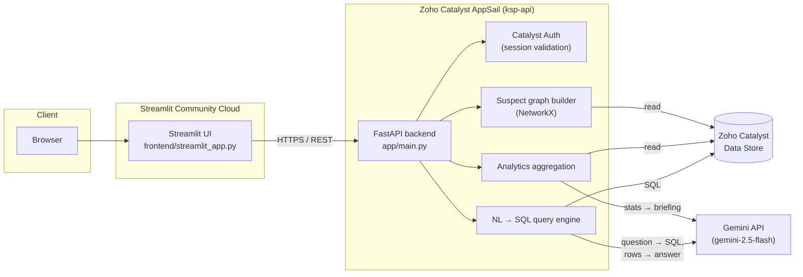

# KSP Crime Analytics

Bilingual (English / ಕನ್ನಡ) natural-language intelligence over Karnataka State Police FIR data — ask a question in plain English or Kannada, get a sourced answer, a live dashboard, and a suspect association network, without writing a single line of SQL.

**Live app:** https://hpm8etkorzw5obcrdb7knz.streamlit.app
**API:** https://ksp-api-50044130144.development.catalystappsail.in

---

## Problem Statement

Police FIR data is rich but locked behind SQL and static reports. An officer investigating a pattern — "how many cybercrime cases in Mysuru this quarter," "which suspects keep showing up together" — either waits on a report or learns a query language. In a state with two working languages, that gap is worse: most analytics tooling only speaks English.

KSP Crime Analytics closes that gap with a conversational layer over the same data: ask in English or Kannada, get an answer grounded in the actual records, plus the SQL that produced it for verification. Alongside the Q&A, it surfaces a standing dashboard and an automatically-inferred suspect network, so patterns that would take a manual cross-reference to spot — repeat offenders, gang clusters, hotspot areas — are visible at a glance.

## Key Features

- **🔍 Ask a Question** — natural-language querying in English or Kannada (typed or via browser speech-to-text). An LLM translates the question into a safe, read-only SQL query, runs it, and writes the answer back in the same language the question was asked in — with the generated SQL always shown for transparency.
- **📊 Dashboard** — aggregate statistics (crime type breakdown, district/area hotspots, case status, monthly trend) plus an LLM-written briefing summarizing the notable patterns.
- **🕸️ Suspect Network** — a graph of suspects linked by explicit associations (gang, family, co-accused) and by appearing as co-accused on the same FIR, with community detection and centrality ranking to surface key figures.

## Architecture



The frontend and backend are deployed independently and talk over plain HTTPS — there's no shared process or session state between them, which is what lets each half live on the platform best suited to it (see [Deployment](#deployment) for why).

## Tech Stack

| Layer | Technology |
|---|---|
| Frontend | [Streamlit](https://streamlit.io) — Python-native reactive UI, Plotly for charts/network graph |
| Backend | [FastAPI](https://fastapi.tiangolo.com) on Uvicorn — async REST API |
| LLM | Google **Gemini** (`gemini-2.5-flash`) for NL→SQL translation and answer generation, with Anthropic Claude as a drop-in alternate provider |
| Data store | SQLite locally / **Zoho Catalyst Data Store** (via ZCQL) in production |
| Graph analysis | [NetworkX](https://networkx.org) — association graph, community detection, centrality |
| Auth | Zoho Catalyst session authentication (`zcatalyst-sdk`) |
| Hosting | **Zoho Catalyst AppSail** (backend) + **Streamlit Community Cloud** (frontend) |
| Language | Python 3.12 |

## Data Model

Four tables, seeded synthetically for demo purposes (`data/seed.py`) and swappable for real data of the same shape:

| Table | Purpose | Key columns |
|---|---|---|
| `fir_records` | One row per First Information Report | `fir_id`, `date_filed`, `district`, `police_station`, `crime_type`, `area`, `status`, `section_of_law` |
| `suspects` | One row per known suspect/accused | `suspect_id`, `name`, `age`, `known_address`, `prior_cases` |
| `fir_suspect_links` | Many-to-many: who's involved in which FIR | `fir_id`, `suspect_id`, `role` (Accused / Witness / Victim) |
| `suspect_associations` | Explicit ties between suspects | `suspect_id_a`, `suspect_id_b`, `relation_type`, `confidence` |

The full schema (with column-level descriptions) lives in `app/core/schema.py` and is the single source of truth shared by the seeder and the LLM's query-generation prompt, so the two never drift apart.

## API Reference

All endpoints are served under `/api` by the FastAPI backend. Every route currently runs with `AUTH_ENABLED=false` (see [Security Notes](#security-notes)).

| Method | Path | Purpose |
|---|---|---|
| `POST` | `/api/query` | Natural-language question in → SQL generated, executed, and answered in the same language. |
| `GET` | `/api/analytics` | Aggregate FIR statistics. `?language=en\|kn` and `?summary=true` add an LLM-written briefing. |
| `GET` | `/api/graph` | Suspect association network: nodes, edges, layout coordinates, and centrality/community stats. |
| `GET` | `/api/health` | Liveness probe — returns `{"status": "ok"}`. |
| `POST` | `/api/debug/seed` | Diagnostics: bulk-insert rows into a table. **Disabled** (`DEBUG_ERRORS=false`) outside local dev. |
| `GET` | `/api/debug/zcql` | Diagnostics: run a raw ZCQL query. **Disabled** (`DEBUG_ERRORS=false`) outside local dev. |

### `POST /api/query` — request / response

```jsonc
// Request
{ "question": "How many thefts were reported in Bengaluru Urban?" }

// Response
{
  "question": "How many thefts were reported in Bengaluru Urban?",
  "sql": "SELECT COUNT(fir_id) FROM fir_records WHERE crime_type = 'Theft' AND district = 'Bengaluru Urban'",
  "explanation": "Counts theft FIRs filed in Bengaluru Urban.",
  "rows": [{ "COUNT(fir_id)": 112 }],
  "answer": "There were 112 thefts reported in Bengaluru Urban.",
  "language": "en"
}
```

### Request flow for a question

1. Streamlit posts the question to `/api/query`.
2. The backend sends the question, the table schema, and a set of safety rules to Gemini, asking for a single `SELECT` statement as structured JSON (`app/services/query_engine.py`).
3. The generated SQL is checked against a denylist (`insert`/`update`/`delete`/`drop`/`alter`/`attach`/`pragma`) before it's allowed to run — only read-only `SELECT`s ever reach the data store.
4. The query executes against the Catalyst Data Store (or local SQLite).
5. The question, SQL, and resulting rows go back to Gemini, which writes a concise answer in the same language the question was asked in.
6. The full result — answer, raw rows, and the SQL used — returns to the UI in one response.

The Dashboard and Suspect Network tabs skip the SQL-generation step (they run fixed aggregation/graph-building logic) but the Dashboard's narrative briefing goes through the same LLM call pattern.

## Project Structure

```
app/
  main.py                  FastAPI app, middleware, error handling
  api/routes.py             Route definitions
  core/
    catalyst_auth.py        Session auth (no-op locally, Catalyst-validated in prod)
    catalyst_datastore.py   SQLite / Catalyst Data Store abstraction
    llm_client.py            Gemini / Anthropic provider-agnostic LLM client
    schema.py                 Shared table schema definitions
  services/
    query_engine.py          NL → SQL → answer pipeline
    analytics.py               Aggregate stats + LLM briefing
    graph_builder.py           Suspect network construction (NetworkX)
frontend/
  streamlit_app.py           Streamlit UI (all three tabs)
data/
  seed.py                     Synthetic data generator
  export_csv.py                 Dump SQLite tables to CSV
  export/                       CSV snapshots of seeded data
deploy/
  backend/, frontend/           Vendored, deployment-ready copies used by
                                  Catalyst AppSail (not committed — see below)
```

## Getting Started (local development)

```bash
# 1. Clone and set up a virtual environment
git clone https://github.com/divya-d510/ksp.git
cd ksp
python -m venv .venv
.venv\Scripts\activate        # Windows
# source .venv/bin/activate   # macOS/Linux

# 2. Install dependencies
pip install -r requirements.txt

# 3. Configure environment
cp .env.example .env
# then edit .env and set GEMINI_API_KEY (free tier: https://aistudio.google.com/apikey)

# 4. Seed the local database
python -m data.seed

# 5. Run the backend
python -m uvicorn app.main:app --reload --port 8000

# 6. In a second terminal, run the frontend
streamlit run frontend/streamlit_app.py
```

The frontend defaults to `FASTAPI_INTERNAL_URL=http://localhost:8000`, so no extra config is needed for local runs against a local backend.

## Deployment

The two services are deployed independently:

| Service | Platform | Why |
|---|---|---|
| Backend (`ksp-api`) | Zoho Catalyst AppSail | Stateless REST API — a natural fit for AppSail's request/response model, and colocated with the Catalyst Data Store it reads from. |
| Frontend (`ksp-ui`) | Streamlit Community Cloud | Streamlit requires a persistent WebSocket connection for its live UI updates. Catalyst AppSail enforces a hard 30-second timeout on every request with no WebSocket exemption, which breaks Streamlit's connection on a loop. Streamlit's own hosting has no such limit, so the frontend lives there while still calling the Catalyst-hosted API over plain HTTPS. |

Backend redeploys (after any code or config change):

```bash
catalyst deploy --only appsail:ksp-api
```

`deploy/backend/` and `deploy/frontend/` are pre-vendored, deployment-ready copies of the app plus all dependencies (required because Catalyst AppSail doesn't run `pip install` reliably at build time). They're regenerated locally and intentionally **not** committed to git — see `.gitignore`.

## Environment Variables

| Variable | Where | Purpose |
|---|---|---|
| `GEMINI_API_KEY` | backend | Gemini API key. If unset, falls back to `ANTHROPIC_API_KEY`. |
| `ANTHROPIC_API_KEY` | backend | Alternate LLM provider; used if `GEMINI_API_KEY` is absent. |
| `LLM_PROVIDER` | backend | Force `gemini` or `anthropic` explicitly, overriding auto-detection. |
| `DATASTORE_BACKEND` | backend | `sqlite` (local) or `catalyst` (production). |
| `AUTH_ENABLED` | backend | Gates Catalyst session validation on every request. See [Security Notes](#security-notes). |
| `DEBUG_ERRORS` | backend | Enables stack traces and the `/api/debug/*` diagnostic routes. Must be `false` outside local dev. |
| `FASTAPI_INTERNAL_URL` | frontend | Base URL the Streamlit app calls for the backend API. |

## Security Notes

Documented deliberately, not as an afterthought:

- **`AUTH_ENABLED` is currently `false`** in production. The Streamlit frontend calls the backend as a plain server-to-server HTTP client and does not forward any per-user session, so turning this on today would break the app rather than secure it. Enabling real authentication requires either a shared-secret/API-key check between the two services or forwarding Catalyst user sessions end to end — tracked as the main open item before this handles real case data.
- **`DEBUG_ERRORS` must stay `false`** outside local development — it gates two diagnostic routes (`/api/debug/seed`, `/api/debug/zcql`) that allow unrestricted writes and raw query execution against the data store.
- **API keys are never committed.** They're supplied via `.env` locally (gitignored) and via `deploy/backend/app-config.json`'s `env_variables` at deploy time (also gitignored). If a key is ever exposed, treat it as compromised and rotate it — see below — rather than relying on removing it from git history alone.

## If the Gemini API key expires or is revoked

1. Generate a new key at https://aistudio.google.com/apikey (free tier).
2. Update it in **two** places — both are gitignored, so this never touches version control:
   - `.env` (`GEMINI_API_KEY=...`) — for local development.
   - `deploy/backend/app-config.json` → `env_variables.GEMINI_API_KEY` — this is what the live backend actually uses.
3. Redeploy the backend: `catalyst deploy --only appsail:ksp-api`.
4. Nothing changes on the frontend — Streamlit Cloud never sees the LLM key, it only talks to the backend over HTTPS.

To switch providers entirely (e.g. to Anthropic), set `ANTHROPIC_API_KEY` in the same two places and either remove `GEMINI_API_KEY` or set `LLM_PROVIDER=anthropic` explicitly — `app/core/llm_client.py` picks the provider automatically based on which key is present.

## Roadmap

- Wire real per-request authentication between frontend and backend (see Security Notes).
- Replace synthetic seed data with a real FIR data ingestion path.
- Add pagination to `/api/query` results for large result sets.
